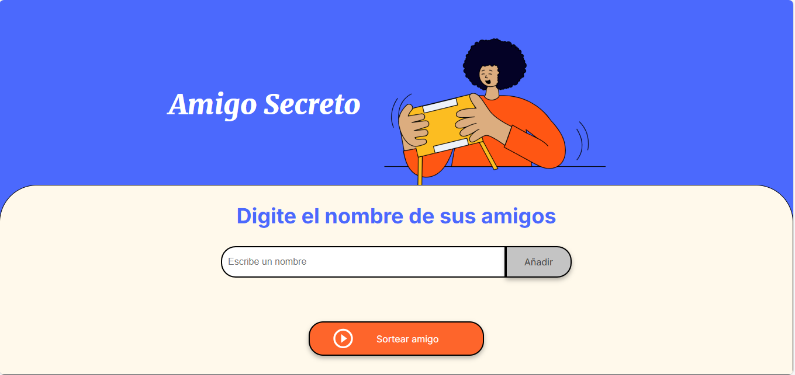

# Amigo Secreto 🎁

¡Bienvenido a **Amigo Secreto**! Este proyecto te permite gestionar una lista de amigos y realizar un sorteo aleatorio para elegir un **Amigo Secreto** de manera divertida y sencilla.

## 🚀 Funcionalidades
- Agregar nombres de amigos a la lista.
- Evitar nombres vacíos.
- Mostrar la lista de participantes.
- Realizar el sorteo aleatorio.
- Limpiar la lista después del sorteo.

## 🛠 Tecnologías usadas
- **HTML** - Estructura de la página.
- **CSS** - Diseño y Estilos.
- **JavaScript** - Lógica para manejar la lista de amigos y el sorteo.

### 📌 Pantalla principal:


---

## 📌 Instalación y uso
1. Clona el repositorio:
   ```sh
   git clone https://github.com/EdsonCasta/challenge-amigo-secreto_esp-main.git
2. Abre el archivo index.html en tu navegador.
3. Ingresa un nombre en el campo de entrada.
4. Haz clic en **"Añadir"** para incluirlo en la lista.
5. Una vez agregados todos los amigos, haz clic en **"Sortear amigo"** para elegir un Amigo Secreto.
6. El nombre sorteado se mostrará en pantalla.
